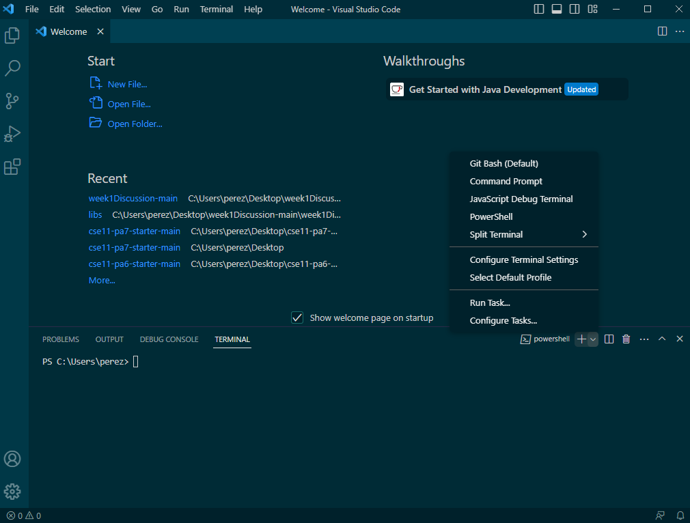
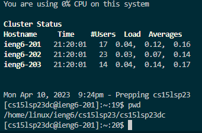

# Lab Report 1
## **Remote Access and File System:**

**Step 1: Insalling VS Code -**
* Click [here](https://code.visualstudio.com/) in order to get to the page to download visual studio code.
* Once you click on the link follow the instructions
* Once you have done that, open visual studio (It should something like below)

**Step 2: Accessing Bash -**
* Install [Git](https://gitforwindows.org/)
* Open VS Code
* Click on the arrow by the plus on the bottom of the plus sign on the bottom of the page as seen below

* You are now using Bash

**Step 3: Getting Your ieng6 ID-**
* Go [here](https://sdacs.ucsd.edu/~icc/index.php)
* Login with your UCSD account if you have everything remembered, if not, follow the other instructions on the page
* Your ID should be under additional accounts, starting with "CSE15l"

* Reset password if needed

**Step 4: Commands -**
* In a new terminal type $ ssh [YOUR CSE15l]@ieng6.ucsd.edu
* Then, type in your password. If the terminal asks for anything say yes.
* Run some commands
* ex: cd (change directory), ls (list files/folders in path), etc.
* use pwd anytime to check the current directory

[Back](https://ienaweigh.github.io/cse15l-lab-reports/)

