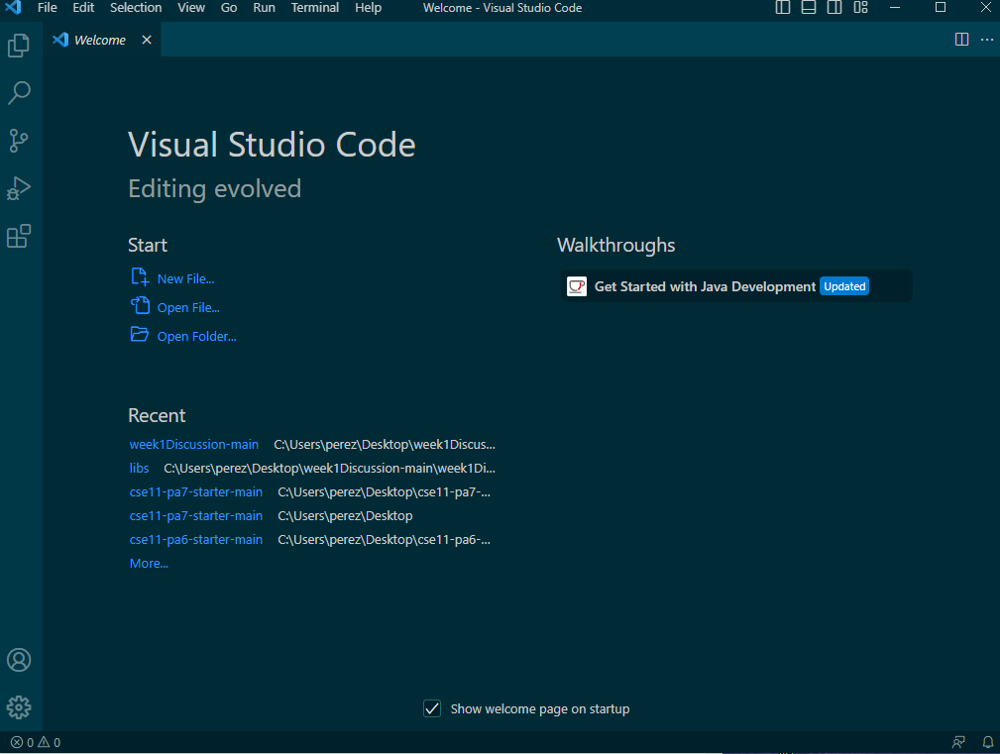

# Lab Report 1
## **Remote Access and File System:**

**Step 1: Insalling VS Code -**
* Click [here](https://code.visualstudio.com/) in order to get to the page to download visual studio code.
* Once you click on the link follow the instructions
* Once you have done that, open visual studio (It should something like below)

**Step 2: Accessing Bash -**
* Install [Git](https://gitforwindows.org/)
* Open VS Code
* Click on the arrow by the plus on the bottom of the plus sign on the bottom of the page as seen below
* 
[Back](https://ienaweigh.github.io/cse15l-lab-reports/)

