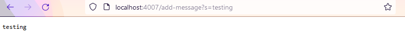
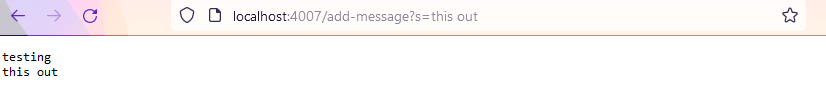
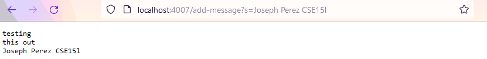
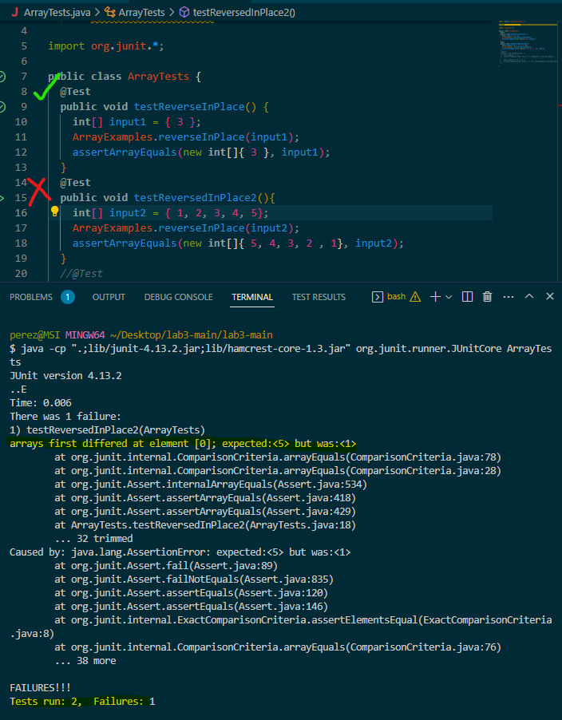

# Part 1
`handleRequest` is called. It takes in the `url` as an input. `getPath` and `contains` are both called when checking for the path.
`split` is used when seperating the string from the rest of the url. The url is a useful value
as well as the string value that is updated everytime a message is added.
The `wordsReal`value starts of as a blank string, but it gets strings added to it as the user adds messages.



```
import java.io.IOException;
import java.net.URI;

class Handler implements URLHandler {
    // The one bit of state on the server: a number that will be manipulated by
    // various requests.
    String wordsReal = "";

    public String handleRequest(URI url) {
        if (url.getPath().equals("/")) {
            return String.format("");
        }   
        if (url.getPath().contains("/add-message")) {
                String[] parameters = url.getQuery().split("s=");
                wordsReal += parameters[1] + "\n";
                return wordsReal;
            }
        
         else {
            System.out.println("Path: " + url.getPath());
            return "404 Not Found!";
        }
    }
}

class StringServer {
    public static void main(String[] args) throws IOException {
        if(args.length == 0){
            System.out.println("Missing port number! Try any number between 1024 to 49151");
            return;
        }

        int port = Integer.parseInt(args[0]);

        Server.start(port, new Handler());
    }
}

```

# Part 2
One bugged method is the testReverseInPlace method. One input which does not produce any symptoms
would be a single number since no matter how you manipulate the order of a single number, the same. For example `{ 3 }` would cause no symptoms.
number will appear. One input that would cause symptoms would be something like {1, 2, 3, 4, 5}. 

```
  static void reverseInPlace(int[] arr) {
    for(int i = 0; i < arr.length; i += 1) {
      int tempNum = arr[i];
      arr[i] = arr[arr.length - i - 1];
      arr[arr.length - 1 - i] = tempNum;
    }
  }
```

old code ^

```
  static void reverseInPlace(int[] arr) {
    for(int i = 0; i < arr.length/2; i += 1) {
      int tempNum = arr[i];
      arr[i] = arr[arr.length - i - 1];
      arr[arr.length - 1 - i] = tempNum;
    }
  }
```

new code ^

Adding the divided by 2 gets rid of the symptom and squashes the bug because the bug was that the nth and length - nth numbers were being switched as the method looped through. However, after you get past the halfway point, you begin switching numbers that have already been switched. Therefore, you only need to loop through half the length of the array.

# Part 3
I learned how to locally host webservers using Java. I also learned how changing directory could be important
when having compiling errors if you are in the wrong directory when trying to compile.
