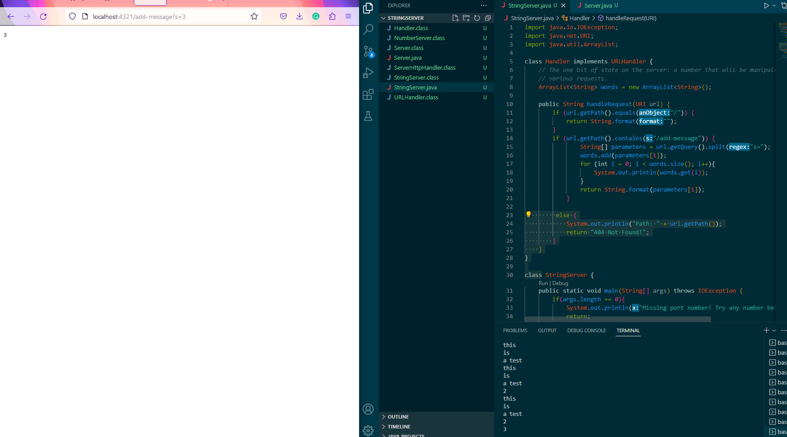
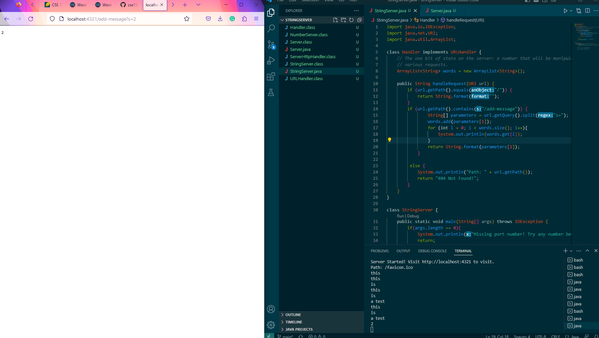
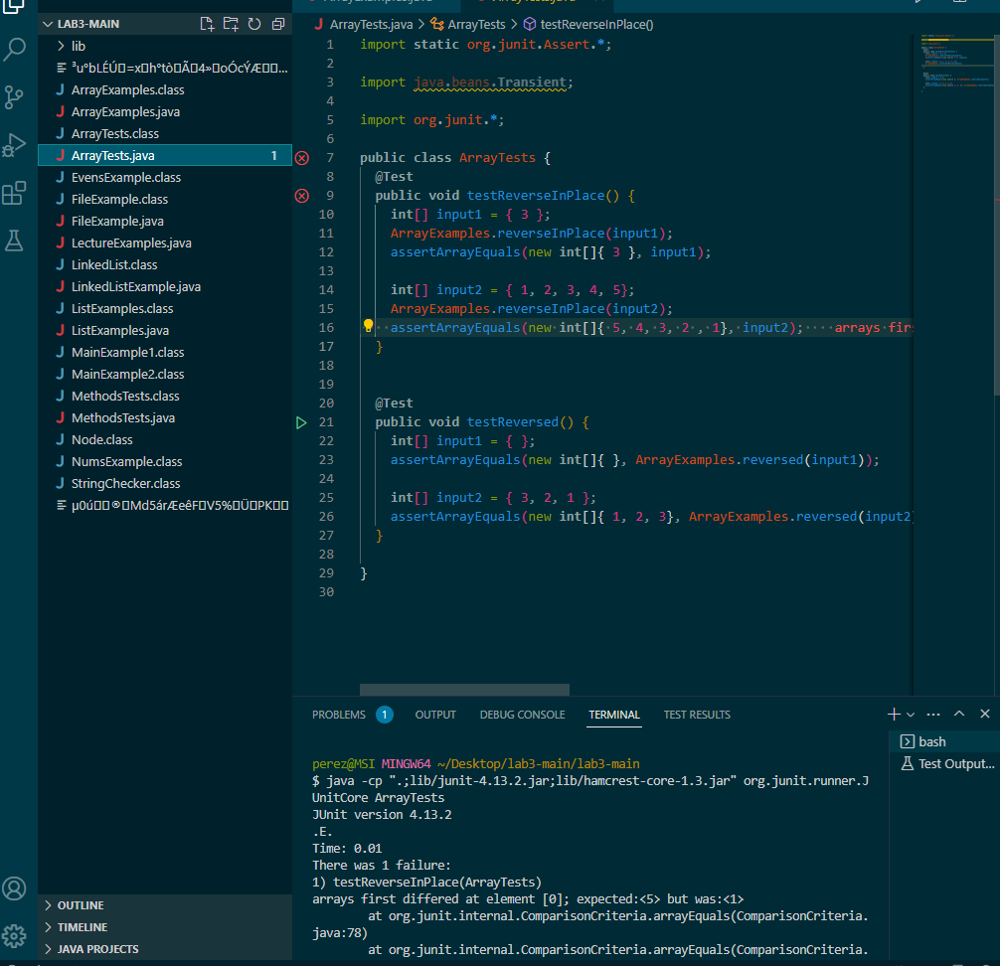

# Part 1
Handle request is called. It takes in the url as an input. GetPath and contains are both called whenc checking for the path.
Split is used when seperating the string from the rest of the url. The url is a useful value
as well as the ArrayList of values that holds all the words.

# Part 2
One bugged method is the testReverseInPlace method. One input which does not produce any symptoms
would be a single number since no matter how you manipulate the order of a single number, the same. For example `{ 3 }` would cause no symptoms.
number will appear. One input that would cause symptoms would be something like {1, 2, 3, 4, 5}. 

`  static void reverseInPlace(int[] arr) {
    for(int i = 0; i < (arr.length); i += 1) {
      int tempNum = arr[i];
      arr[i] = arr[arr.length - i - 1];
      arr[arr.length - 1 - i] = tempNum;
    }
  }
 `

old code ^

`  static void reverseInPlace(int[] arr) {
    for(int i = 0; i < (arr.length / 2); i += 1) {
      int tempNum = arr[i];
      arr[i] = arr[arr.length - i - 1];
      arr[arr.length - 1 - i] = tempNum;
    }
  }
`

new code ^

# Part 3
I learned how to locally host webservers using Java. I also learned how changing directory could be important
when having compiling errors if you are in the wrong directory when trying to compile.
