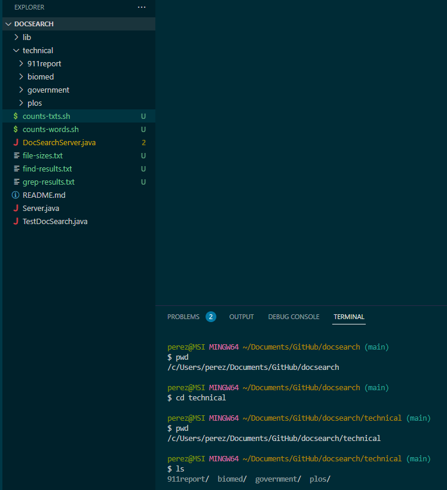
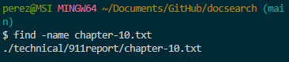
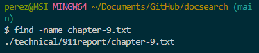
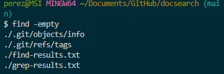
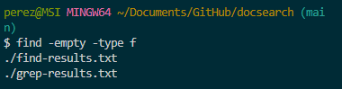
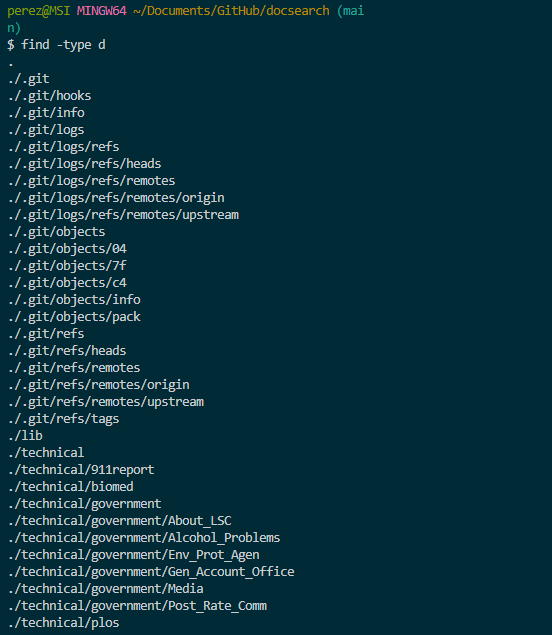
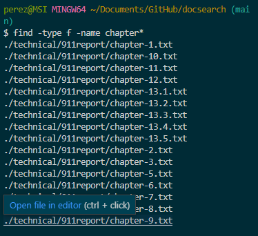
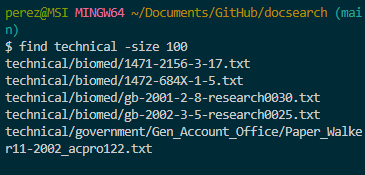
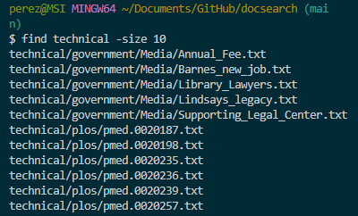

# Where I am doing this

# -name
#### This matches your next search with any file that has the same name as your search. This is useful when looking for a specific file.
### `find -name chapter-10.txt`
./stringsearch-data/technical/911report/chapter-10.txt

### `find -name chapter-9.txt`
./stringsearch-data/technical/911report/chapter-9.tx

# -empty
#### This searches for empty files and directories. This is useful when looking for files that are empty.
### `find -empty`
./.git/objects/info
./.git/refs/tags
./find-results.txt
./grep-results.txt

### `find -empty -type f`
./find-results.txt
./grep-results.txt

# -type
#### This searches for things of the type specified. As seen below, d an f are used. d specifies directories. f specifies files. This is useful for when you only want to search for certain types of things.
### `find -type d`
.
./.git
./.git/hooks
./.git/info
./.git/logs
./.git/logs/refs
./.git/logs/refs/heads
./.git/logs/refs/remotes
./.git/logs/refs/remotes/origin
./.git/logs/refs/remotes/upstream
./.git/objects
./.git/objects/04
./.git/objects/7f
./.git/objects/c4
./.git/objects/info
./.git/objects/pack
./.git/refs
./.git/refs/heads
./.git/refs/remotes
./.git/refs/remotes/origin
./.git/refs/remotes/upstream
./.git/refs/tags
./lib
./technical
./technical/911report
./technical/biomed
./technical/government
./technical/government/About_LSC
./technical/government/Alcohol_Problems
./technical/government/Env_Prot_Agen
./technical/government/Gen_Account_Office
./technical/government/Media
./technical/government/Post_Rate_Comm
./technical/plos

### `find -type f -name chapter*`
./technical/911report/chapter-1.txt
./technical/911report/chapter-10.txt
./technical/911report/chapter-11.txt
./technical/911report/chapter-12.txt
./technical/911report/chapter-13.1.txt
./technical/911report/chapter-13.2.txt
./technical/911report/chapter-13.3.txt
./technical/911report/chapter-13.4.txt
./technical/911report/chapter-13.5.txt
./technical/911report/chapter-2.txt
./technical/911report/chapter-3.txt
./technical/911report/chapter-5.txt
./technical/911report/chapter-6.txt
./technical/911report/chapter-7.txt
./technical/911report/chapter-8.txt
./technical/911report/chapter-9.txt

# -size
#### This gives you an output of the files that have the amount of blocks specified in the argument. In my examples I search for files of size 100 blocks and of size 10 blocks. This is useful when maybe there you want to get rid of things of a certain size.
### `find technical -size 100`
technical/biomed/1471-2156-3-17.txt
technical/biomed/1472-684X-1-5.txt
technical/biomed/gb-2001-2-8-research0030.txt
technical/biomed/gb-2002-3-5-research0025.txt      
technical/government/Gen_Account_Office/Paper_Walker11-2002_acpro122.txt
### `find technical -size 10`
technical/government/Media/Annual_Fee.txt
technical/government/Media/Barnes_new_job.txt
technical/government/Media/Library_Lawyers.txt     
technical/government/Media/Lindsays_legacy.txt
technical/government/Media/Supporting_Legal_Center.technical/government/Media/Lindsays_legacy.txt     
technical/government/Media/Supporting_Legal_Center.txt
technical/plos/pmed.0020187.txt
technical/plos/pmed.0020198.txt
technical/plos/pmed.0020235.txt
technical/plos/pmed.0020236.txt
technical/plos/pmed.0020239.txt
technical/plos/pmed.0020257.txt

----------------
sources:
https://www.baeldung.com/linux/find-command
https://www.geeksforgeeks.org/find-command-in-linux-with-examples/
https://ucsd-cse15l-s23.github.io/week/week5/
