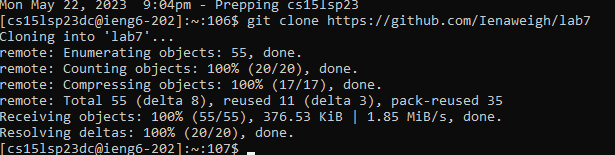
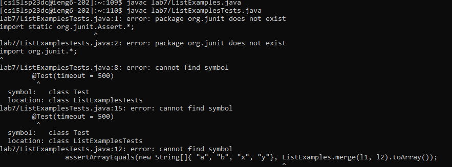
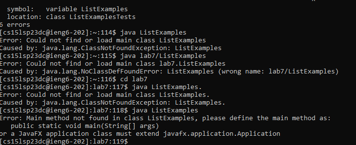
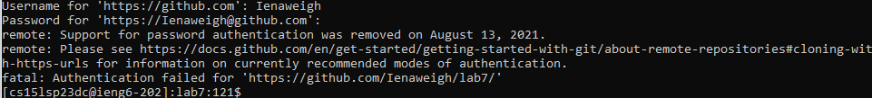

# Step 4

`ssh cs15lsp23dc@ieng6.ucsd.edu` <enter>
  this logged me into my remote account.

# Step 5
  
`git clone https://github.com/Ienaweigh/lab7` <enter>
  git clone cloned my fork of the repository
  
  
# Step 6
  
javac ListExamples.java
  (did not work)
  
# Step 7
  
:44 <enter> :s/index1/index2 <enter>
  goes to line 44, replaces index1 with index2
 
# Step 8
  
javac ListExamples.java
 (did not work)
  
# Step 9
  
git push
  (did not work)
