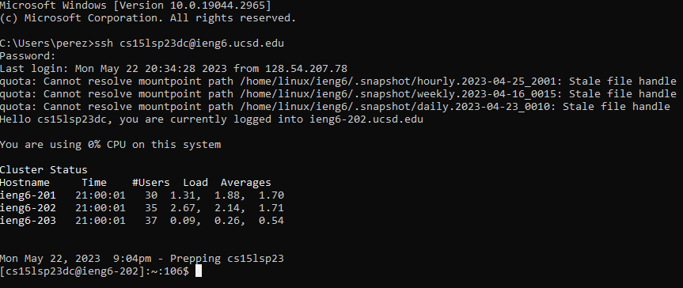
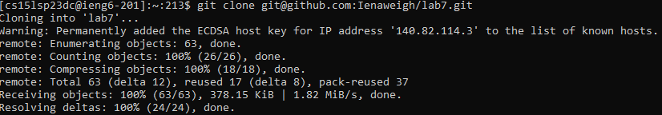
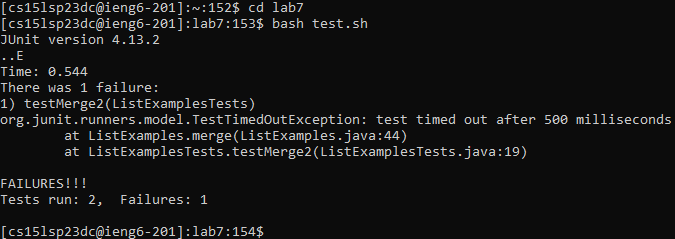
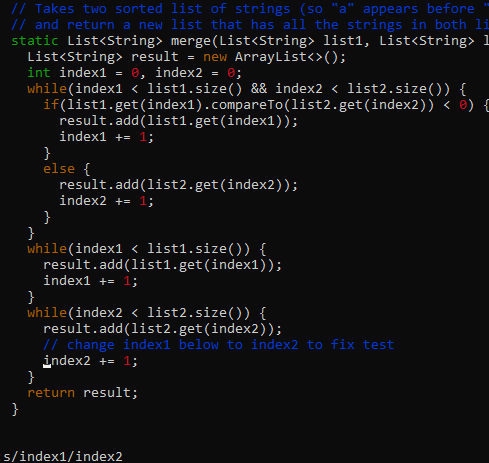
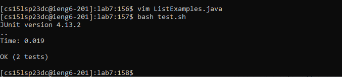
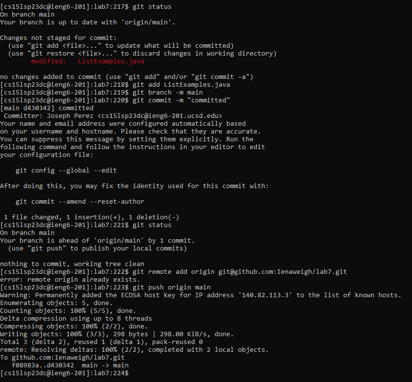

# Step 4

`<ssh cs15lsp23dc@ieng6.ucsd.edu> <enter>`
  this logged me into my remote account.

# Step 5
  
  
`<git clone git@github.com:Ienaweigh/lab7.git> <enter>`
  
  `git clone` cloned my fork of the repository
  
  
# Step 6
  
`<bash test.sh> <enter>`
this runs the bash script "test.sh" which compiles and runs the ListExamplesTests.java among other things, showing what tests pass and which fail.
  
# Step 7
  
  

`<:44> <enter> <:s/index1/index2> <enter>`
  `:44` goes to line 44. `:s/index1/index2` replaces index1 with index2 on that line.
  
  (to get here I changed my directory to go into lab7 by doing `<cd lab7> <enter>` and using `<vim ListExamples.java> <enter>` to edit the file using vim)
 
# Step 8
  
  
`<bash test.sh> <enter>`
this again runs "test.sh" which again compiles and runs the ListExamplesTests.java file and allows us to see which tests pass.
  
# Step 9
  

`<git add ListExamples.java> <enter>` (this adds ListExamples.java to the files I want to commit next) 

`<git branch -m main> <enter>` (this makes it so "-m" means "main" for future use) 

`<git commit -m "committed"> <enter>` (this commits what I added to the main branch (-m means main now). I also added a message saying "committed")

`<git remote add origin git@github.com:Ienaweigh/lab7.git> <enter>` (this basically makes it so I push to this repository when I commit. However, I got an error because I cloned from this same repsoitory I think.) 

`<git push origin main> <enter>` (This pushes what I committed to my lab7 repository)
