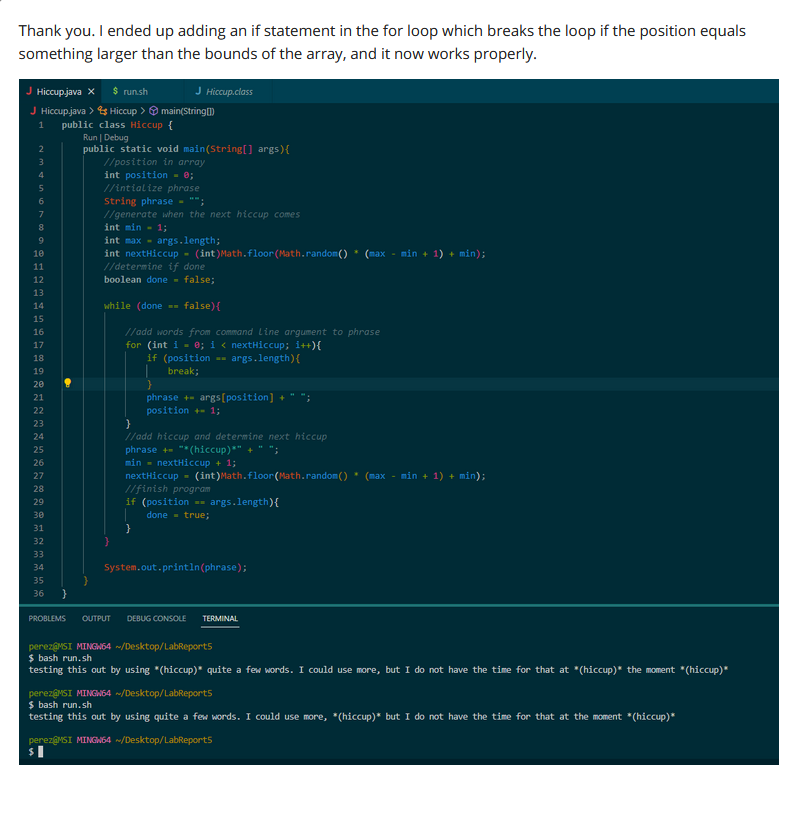

# Here is the student question

# Here is the TA response

# Student fixing bug

# REFLECTION
I learned how to use vim which was really interesting to me because it showed me that basically everything could be done from a command line even though it is a lot more inconvinient. It is still cool regardless of its current utility for me.
